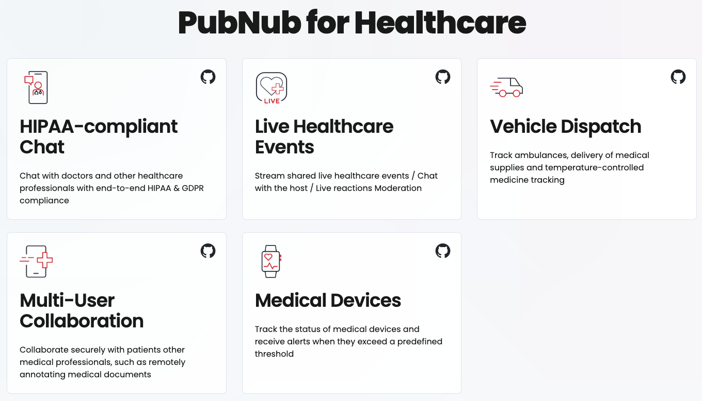

# PubNub Healthcare Demo

## Demo

A hosted version of this demo can be found at https://pubnub-healthcare.netlify.app/

## Features of the PubNub Healthcare demo and PubNub APIs used

| Demo | Description | PubNub APIs used |
| ---- | --- | ---------------- |
| HIPAA and GDPR compliant Chat | Uses the PubNub SDK to show how a chat application could be implemented compliant with both HIPAA and GDPR, with features such as group In-App Messaging, typing indicators, message reactions, unread message counts and presence indicators. |  [Publish & Subscribe](https://www.pubnub.com/docs/sdks/javascript/api-reference/publish-and-subscribe), [Presence](https://www.pubnub.com/docs/sdks/javascript/api-reference/presence), [Message Persistence](https://www.pubnub.com/docs/sdks/javascript/api-reference/storage-and-playback) (for Message Persistence & unread message counts), [App Context](https://www.pubnub.com/docs/sdks/javascript/api-reference/objects), [Message Reactions](https://www.pubnub.com/docs/sdks/javascript/api-reference/message-actions)  (message reactions & read indicators), [Functions](https://www.pubnub.com/docs/general/serverless/functions/overview) (for moderation)  |
| Live Healthcare Events | Shows how PubNub can make a high-occupancy live event interactive, with polls and live chat | [Publish & Subscribe](https://www.pubnub.com/docs/sdks/javascript/api-reference/publish-and-subscribe) for chat and [Signals](https://www.pubnub.com/docs/general/messages/publish#send-signals) for reactions  |
| Vehicle Dispatch | Share vehicle location or the location of any asset securely over PubNub.  Track those vehicles and assets as they move in real-time | [Publish & Subscribe](https://www.pubnub.com/docs/sdks/javascript/api-reference/publish-and-subscribe) |
| Doctor-Patient Collaboration | Real-time collaboration is demonstrated with a whiteboard app | [Publish & Subscribe](https://www.pubnub.com/docs/sdks/javascript/api-reference/publish-and-subscribe)  (for drawing), [User State](https://www.pubnub.com/docs/sdks/javascript/api-reference/presence#user-state) (for cursor position) |
| Medical Devices | Control medical devices and infrastructure as well as see the state of your own devices using PubNub | [Publish & Subscribe](https://www.pubnub.com/docs/sdks/javascript/api-reference/publish-and-subscribe) |

## Usage Notes

### Firefox Users

Firefox will not allow you to share storage between pages.  This is a [feature and not a bug](https://bugzilla.mozilla.org/show_bug.cgi?id=1730419).  Please load the demo from a local server to use with Firefox, e.g. `python3 -m http.server 8001`.  Be sure to use `localhost` rather than the IP address when doing this, for full compatibility with the IoT demo.  *These are only issues running locally, you will not experience issues running a hosted version of this app*

## Installing / Getting started

To run this project yourself you will need a PubNub account. Generate a Google API key by following [these instructions](https://developers.google.com/maps/documentation/javascript/get-api-key). When you [restrict your key](https://console.cloud.google.com/apis/credentials/key/), make sure the following APIs are enabled under the API restrictions section:
- [Maps Embed API](https://developers.google.com/maps/documentation/embed/get-started)
- [Maps JavaScript API](https://developers.google.com/maps/documentation/javascript/overview)
- [Geocoding API](https://developers.google.com/maps/documentation/geocoding/overview)

### Requirements
- [PubNub Account](#pubnub-account) (*Free*)

### Get Your PubNub Keys

1. You’ll first need to sign up for a [PubNub account](https://admin.pubnub.com/signup/). Once you sign up, you can get your unique PubNub keys from the [PubNub Developer Portal](https://admin.pubnub.com/).

1. Sign in to your [PubNub Dashboard](https://admin.pubnub.com/).

1. Click Apps, then **Create New App**.

1. Give your app a name, and click **Create**.

1. Click your new app to open its settings, then click its keyset.

1. Enable the Presence feature on your keyset (check 'Presence Deltas' and 'Generate Leave on TCP FIN or RST')

1. Enable the Message Persistence feature on your keyset and choose a duration

1. Enable the Stream Controller feature on your keyset

1. Enable the Files feature on your keyset and choose a retention duration

1. Enable the App Context feature on your keyset.  Make sure you check all the checkboxes related to events, i.e. User and Channel Metadata Events as well as Membership Events.

1. The hosted variant of this app uses Functions for moderation, specifically [https://www.pubnub.com/integrations/chat-message-profanity-filter/](https://www.pubnub.com/integrations/chat-message-profanity-filter/).

1. Copy the Publish and Subscribe keys and paste them into your app as specified in the next step.

### Building and Running

1. Clone the repository

1. Under the `shared` folder, open `keys.js` and add your keys here, replacing the existing placeholder data.

## Contributing
Please fork the repository if you'd like to contribute. Pull requests are always welcome.

## Logging in with the same user in two or more tabs

The application is designed primarily to be used by two different users in separate tabs (so one user can talk with the other).  If you want to have the same user running in multiple tabs, for example to demonstrate medical device messages in one tab being received in the private chat channel in another tab, then do the following:

- Log in as a user as normal
- `Duplicate` the tab

You can now experience the showcase as the same user in both the original and duplicated tabs.  Be aware that if you log out of one tab, the application will not automatically log you out of the duplicated tab.

